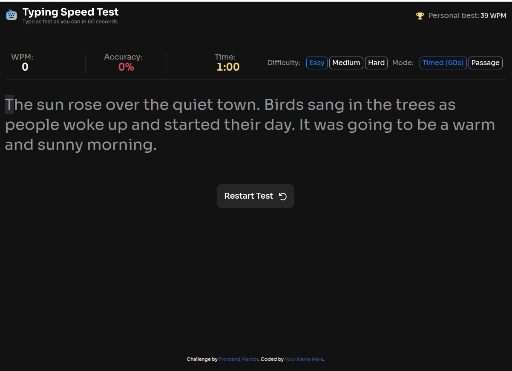

# Frontend Mentor - Typing Speed Test solution

This is a solution to the [Typing Speed Test challenge on Frontend Mentor](https://frontendmentor.io). Frontend Mentor challenges help you improve your coding skills by building realistic projects.

## Table of contents

- [Overview](#overview)
  - [The challenge](#the-challenge)
  - [Screenshot](#screenshot)
  - [Links](#links)
- [My process](#my-process)
  - [Built with](#built-with)
  - [What I learned](#what-i-learned)

- [Author](#author)

## Overview

### The challenge

Users should be able to:

- Start a test by clicking the start button or by clicking the passage area.
- Select a difficulty level (Easy, Medium, Hard) via custom dropdowns (mobile) or inline controls (desktop).
- Switch between **Timed (60s)** mode (countdown) and **Passage** mode (stopwatch counts up, no limit).
- Restart at any time to fetch a new random passage using a state-adaptive toolbar button.
- See real-time WPM, accuracy, and time stats while typing.
- Receive visual feedback for character states: correct (green), errors (red/underlined), and current character highlight.
- Correct mistakes with backspace (original errors still count against accuracy tracking).
- View tailored end-game modals: "Baseline Established!" (first run), "High Score Smashed!" with confetti (new personal best), or standard "Test Complete!".
- Have their personal best persist across browser sessions via `localStorage`.

### Screenshot



### Links

- Solution URL: [https://github.com/gsnezana7/typing-speed-test-main/tree/main]
- Live Site URL: [Add your live site URL here (e.g., GitHub Pages, Vercel, Netlify)]

## My process

### Built with

- Semantic HTML5 markup (including `<output>` for dynamic stats)
- CSS Custom Properties (Variables)
- Responsive layout fluidly converted from pixels to `rem` units for better accessibility
- Flexbox and CSS Grid
- Mobile-first approach with native screen transitions at `768px` and `1200px`
- Modern CSS selectors (`:has()`, `:focus-visible`)
- Vanilla JavaScript (ES6+, Async/Await API fetching)

### What I learned

This project helped me understand the importance of maintainable architecture and strict data handling in vanilla applications.

1. **Eliminating Magic Numbers with Configuration Objects:**
   To prevent structural clutter and improve scalability, I refactored the application settings into a unified global dictionary configuration. This prevents hardcoded dependencies across timers, calculations, and resetting functions:

```js
const CONFIG = {
  DEFAULT_TIME_LIMIT: 60,
  DEFAULT_DIFFICULTY: "easy",
  DEFAULT_MODE: "timed",
  MIN_LENGTH_TO_SAVE: 2,
  CHARS_PER_WORD: 5,
  FALLBACK_TEXT: "The sun rose over the quiet town.",
};

// State binding example:
let timeLeft = CONFIG.DEFAULT_TIME_LIMIT;
```

2. **Accurate Character-Validation State:**
   To keep accuracy calculations accurate, I added unique `dataset` markers on individual text tokens. This blocks repetitive key down-strokes from penalizing user errors multiple times at the exact same caret coordinate:

```js
if (userChar === span.textContent) {
  span.classList.add("char--correct");
  correctChars++;
} else {
  span.classList.add("char--error");
  if (!span.dataset.wasWrong) {
    span.dataset.wasWrong = "true";
    errorCount++;
  }
}
```

3. **Performance Optimization:**
   When rendering strings into arrays of spans, I utilized `DocumentFragment` to batch DOM injections, keeping the page performant and free of layout thrashing.

### Continued development

In future updates, I plan to:

- Refactor the code architecture using ES Modules to isolate the timer, stats calculator, and DOM rendering logics.
- Improve full keyboard navigation access for custom controls to meet standard WCAG guidelines.

## Author

- Frontend Mentor - [@your-username](https://frontendmentor.io)
